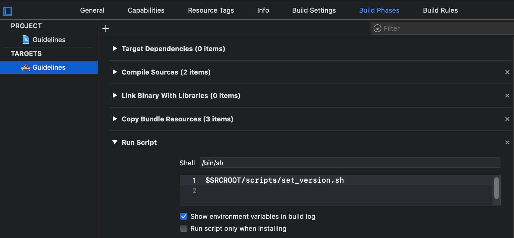
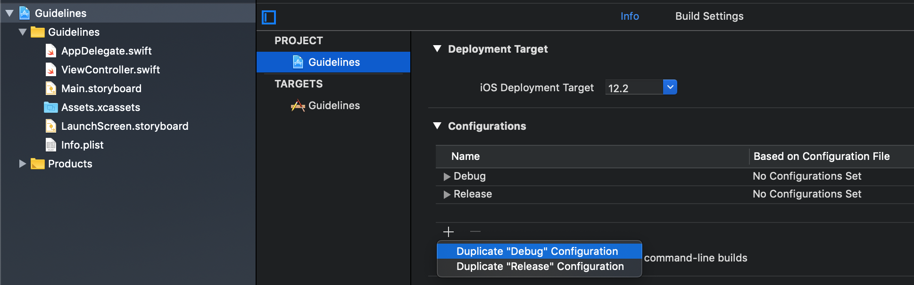
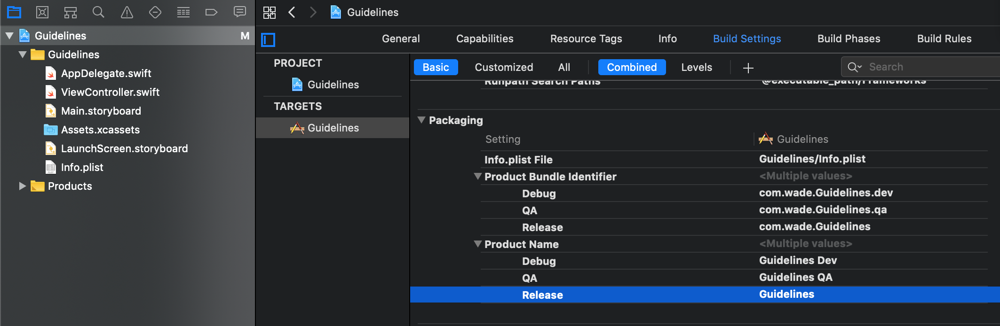

# SWARM React Native Guidelines

## Development Requirements:
- [nodejs](https://nodejs.org/en/download/current/)

## Initialize a new project
we create a creator.sh to help creating and setting a new react-native project. 
Use this command to initialize a new project.
``` bash
bash -c "$(curl -fsSL https://raw.githubusercontent.com/swarmnyc/SWARM-Project-Guidelines/master/react-native/creator.sh)"
```

## File Structure
- android: the folder for native android
- ios: the folder for native ios 
- app: the folder for react native
  - res: the resource folder
    - images: the images folder
    - fonts: the fonts folder
  - src: the source code folder
    - core: the folder for core code
    - scenes: the folder for different scenes, for example,
      - home:
        - home-main.tsx
        - home-search.tsx
        - home-list.tsx
      - detail:
        - detail-main.tsx
        - detail-xxx.tsx
    - services: the folder for service code, for example,
      - api-service
  - test: the test code folder

## Typescript
We build react native apps with [typescript](https://www.typescriptlang.org/index.html) to help projects more readable and debugging easier.

## Naming Styles
- For File Names and Folder Names use KebabCase, for example, `the-file-name.tsx`. the main reason for KebabCase is for the convention of module name. for example, `import { SomeThing } from "./some-thing"`
- For Type Names like class, interface, use PascalCase, for example, `class User { }`
- For variables, function, use CamelCase, for example, `var userName: string`

## Code Styles
- No semicolon. Nowadays new languages such as Kotlin, Swift recommend no semicolon on the end of statements.
- Double-Quote. We use double-quote instead of single-quote. 

We use eslint and prettier to check the styles. IDE like vscode detect the errors if you installed the extensions. Or you can run `npm run lint` to check manually.

## Resource Styles
We would like centralize resources under `res` folder and put to objects for using easily. 

For example,
``` ts
// ./app/res/string-res.ts
export const StringRes = {
  app: {
    // if resources are only belong to one scene, we group in one object
    welcome: "Welcome to React Native!",
    instruction: "To get started, edit app/src/scenes/app.tsx",
    instructions: Platform.select({
      ios: 'Press Cmd+R to reload,\n' + 'Cmd+D or shake for dev menu',
      android:
        'Double tap R on your keyboard to reload,\n' +
        'Shake or press menu button for dev menu'
    })
  },
  login: "Login",
  logout: "Logout"
}

// ./app/res/image-res.ts
export const ImageRes = {
  // using ic, bg or others prefix for icon and background for better identifying
  icAdd: require("./images/ic-add.png"),
  icDelete: require("./images/ic-delete.png")
}
```

## App Version
Unlike other projects, Android and iOS app has two version options:
- Version Code: a number that can only be increased. fails if uploading the same number to stores
- Version Name: a string that can be every string, stores accepts the same string.

We recommends use git commit count for version code, so the number can automatically increase for every commit. Also, manually change version name on package.json, so we just need to change one place.

### On Android
1. change **./android/app/build.grade** like below
``` gradle
def APP_VERSION_CODE = Integer.parseInt(System.getenv("APP_VERSION_CODE") ?: 'git rev-list --count HEAD'.execute().text.trim())
def APP_VERSION_NAME = System.getenv("APP_VERSION_NAME") ?: (new groovy.json.JsonSlurper().parseText(file("../../package.json").text)).version

android {
  defaultConfig {
    versionCode APP_VERSION_CODE
    versionName APP_VERSION_NAME
  }
```

### On iOS
1. create **./ios/scripts/set_version.sh**
``` sh
#!/bin/bash

if [ -z "$APP_VERSION_CODE" ]; then
  APP_VERSION_CODE=$(git rev-list HEAD --count)
fi

if [ -z "$APP_VERSION_NAME" ]; then
  APP_VERSION_NAME=$(node -p -e "require('../package.json').version")
fi

target_plist="$TARGET_BUILD_DIR/$INFOPLIST_PATH"
dsym_plist="$DWARF_DSYM_FOLDER_PATH/$DWARF_DSYM_FILE_NAME/Contents/Info.plist"

for plist in "$target_plist" "$dsym_plist"; do
  if [ -f "$plist" ]; then
    /usr/libexec/PlistBuddy -c "Set :CFBundleVersion $APP_VERSION_CODE" "$plist"
    /usr/libexec/PlistBuddy -c "Set :CFBundleShortVersionString ${APP_VERSION_CODE#*v}" "$plist"
  fi
done
```
2. add a new Build Phases to execute the script.

- Select the project on file tree > select the target > select Build Phases
- add **New Run Script Phase**
- add a command to execute `$SRCROOT/scripts/set_version.sh` file



## App ID and Stages
We recommend build apps with three stages:
1. dev: for developers, connect to dev environmental resources
2. qa: for tester, connect to qa environmental resources
3. prod: for everyone, connect to prod environmental resources

Each staged apps has different app ID and name. The reasons for that are the three apps can be installed in the same devices, so developers or testers can launch each apps easily. Also, each apps access resources such as APIs or databases differently. Since each stages are isolated, any actions on QA app won't affect Prod app.

### On Android
On android, we use build types as states.

1. Change **./android/app/build.grade** like below
``` gradle
android {
  buildTypes {
    debug { // debug as dev stage
      applicationIdSuffix ".dev"
      resValue "string", "app_name", "@string/app_name_debug"
    }
    qa {
      applicationIdSuffix ".qa"
      resValue "string", "app_name", "@string/app_name_qa"
    }
    release { // release as prod stage
      resValue "string", "app_name", "@string/app_name_release"
    }
  }
}
```
2. Config three string resources on strings.xml and use it on AndroidManifest.xml, so the name can be different for each stages.

3. You can change build type to run on Android Studio or run gradle script like `./gradlew app:assembleQa` or `./gradlew app:assembleRelease`

4. fix qa build type problems for React Native libraries.
   
   Because React Native libraries has to build along with the app. Unlike other libraries with just reference the jar or aar. So these React Native libraries need to have qa build type as well. To fix that adding this script on **./android/build.gradle**

``` gradle
subprojects { project ->
  project.afterEvaluate {
    def android = project.extensions.findByName("android")
    if (android != null) {
      // to add qa build type for other projects to prevent build failure
      if (android.buildTypes.findByName("qa") == null) {
        android.buildTypes.create("qa") {
          initWith(android.buildTypes.release)
        }
      }
    }
  }
}
```

### On iOS
On iOS, we use configurations as stages.

1. Add the QA configuration. 
- Select the project on file tree > select the project. 
- Then hit the + button under Configurations > select **Duplicate "Release" Configuration**
- change the name to **QA**



2. Change the Product Bundle Identifier and Name. 
- select the project on file tree > select the target > Build Settings. 
- change the Product Bundle Identifier and Product Name for each configurations



4. fix QA configuration problems for React Native libraries.
   
   Because React Native libraries has to build along with the app, so these React Native libraries need to have qa configuration as well.

   - run `npm install react-native-schemes-manager`
   - add this setting on **./package.json**
  ``` json
  {
    "xcodeSchemes": {
      "Release": [
        "QA"
      ],
      "projectDirectory": "ios"
    }
  }
  ```
  - run `npx react-native-schemes-manager all` to this library will add configurations to other React Native libraries.

5. you can change Build Configuration on XCode by go to Menu > Product > Scheme > Edit Scheme or run `xcodebuild` with `-configuration [name]`.

## Pre commit
We use the package [pre-commit](https://github.com/observing/pre-commit) to add a git pre-commit hook to check quality before commit. The hook executes there other commands
- npm run lint: use eslint to check code pass the rules
- npm run test: check project pass the tests
- npm run build: check project can build

If one of three commands fails, the commit fails. If you want to temporarily force commit. you can use commit with `--no-verify` option to skip hook. However, the build server will run these three commands again when a new pull request is created.

## Sample Projects
- [Incident Go (Private)](https://gitlab.com/swarmnyc/incident-code-app)

## VS Code Extensions
- [eslint](https://marketplace.visualstudio.com/items?itemName=dbaeumer.vscode-eslint)
- [Prettier - Code formatter](https://marketplace.visualstudio.com/items?itemName=esbenp.prettier-vscode)

## Developing Tools
- [React Native Debugger](https://github.com/jhen0409/react-native-debugger)